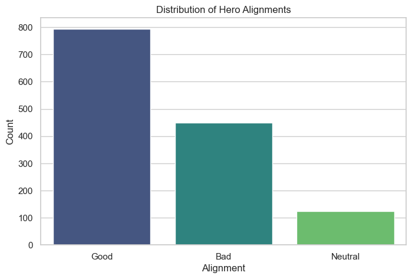
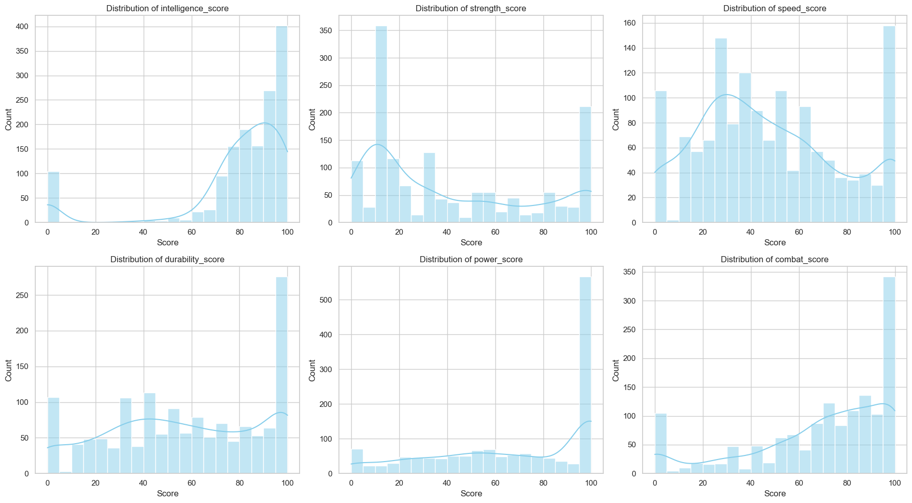
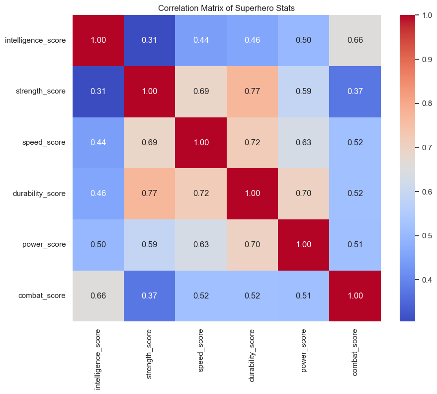
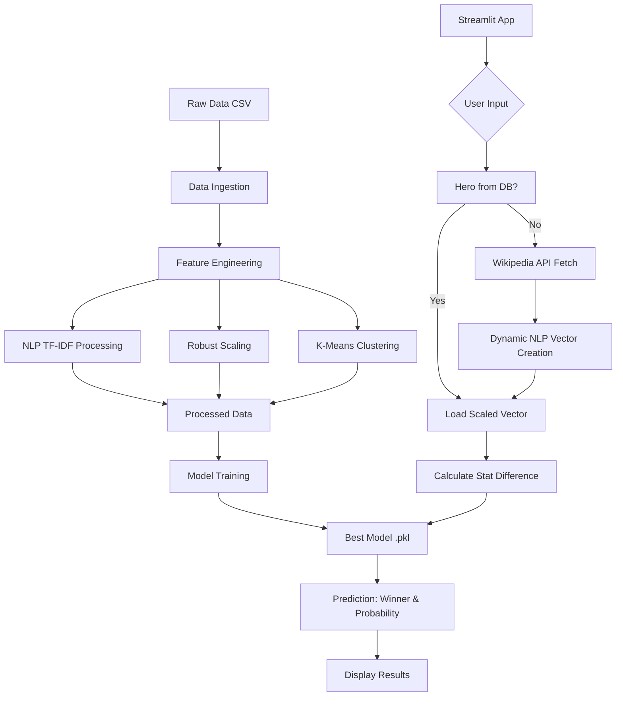

# ⚡ Superhero Battle Simulator

An AI-powered battle simulation engine that combines **NLP**, **Machine Learning**, and **real-time data fetching** to decide who wins in epic superhero (and beyond) matchups.

<p align="center">
  <!-- Live Demo badge - replace YOUR_APP_URL with your actual deployed link -->
  <a href="YOUR_APP_URL_HERE">
    
  </a>

  <!-- Kaggle Dataset badge -->
  <a href="https://www.kaggle.com/datasets/jonathanbesomi/superheroes-nlp-dataset">
    
  </a>

  <!-- Wikipedia API badge (exactly as you already had) -->
  <a href="https://pypi.org/project/Wikipedia-API/">
  
</p>

##  Project Visualizations

### 1. Exploratory Data Analysis (EDA)

**Distribution of Superpowers**  


**numerical stats to analyze**


**NLP WordCloud** (Top terms from hero descriptions)  


**Correlation Heatmap**  



### 2. Model Performance

Trained on a synthetic dataset of **10,000 battles** using strict comic-book hierarchy rules.

| Model              | Accuracy | ROC-AUC  | Status          |
|--------------------|----------|----------|-----------------|
| Logistic Regression| 0.9160   | 0.9746   | Baseline        |
| Random Forest      | 0.9205   | 0.9780   | Strong Performer|
| **LightGBM**       | **0.9295** | **0.9834** | ✅ **Selected** |

## Project Workflow



---

### 🛠️ Installation & Setup
## Prerequisites

 - Python 3.12+
 - pip

# Steps

1. Clone the repository
```bash
git clone https://github.com/VenkateshHJoshi/superhero_battle_sim.git
cd superhero_battle_sim
```
2. Create & activate virtual environment
```bash
python -m venv venv
# macOS / Linux
source venv/bin/activate
# Windows
# venv\Scripts\activate
```
3. Install dependencies
```bash
pip install -r requirements.txt
```
4. Data Setup
- Download: Superheroes NLP Dataset (Kaggle)
- Extract superheroes_nlp_dataset.csv
- Move it to: data/raw/superheroes_nlp_dataset.csv

5. Run the full pipeline
```bash
# Create models folder
mkdir -p models

# 1. Feature engineering (NLP + Scaling + Clustering)
python -m src.feature_engineering

# 2. Train models (selects LightGBM)
python -m src.model_training

# 3. Launch the Streamlit app
streamlit run app.py
```
> Open http://localhost:8501 in your browser

---

## Issue Resolution Highlights

| Issue                                      | Root Cause                                              | Resolution                                                                                   |
|--------------------------------------------|---------------------------------------------------------|----------------------------------------------------------------------------------------------|
| `KeyError: battle_experience_score`        | Hardcoded columns replaced by NLP features              | Use `feature_list.pkl` to dynamically load the exact columns used during training           |
| `ValueError` during scaling (`power_tier`) | Scaler was fitted before `power_tier` column was added  | Exclude `power_tier` from scaling process, append it manually in `utils.py`                 |
| Iron Man beating Silver Surfer             | K-Means wrongly classified tech-based heroes as cosmic  | Implemented priority logic: Tech/suit users capped at Tier 1                                |
| Wikipedia "Page Not Found" error           | App crashes on generic or ambiguous names (e.g. "Flash")| Added `try/except` blocks with user-friendly error messages and fallback suggestions         |

---

### Key Features

- Standard Battle: Choose from 1,450+ heroes in the database

- Mystery Hero Mode: Type any name (Goku, Kratos, Thanos...) → fetches Wikipedia → instant prediction

- Strict Comic Logic: Respects hierarchy (Cosmic > Tech > Mutant > Human)

- Real-time NLP: TF-IDF understands context (e.g. "galaxy", "cosmos" → high power tier)

---

### Conclusion
The Superhero Battle Simulator bridges structured stats and unstructured text to create fair, fun, and surprisingly accurate superhero battles — going far beyond simple number comparisons.

### Future Improvements

- Turn-by-turn battle narrative generation

- Image upload + CNN visual feature extraction

- Real-time multiplayer battles

- Marvel / DC API integration for live stat updates

---

### Contributing
We love contributions from coders, data scientists, and comic nerds!

## Areas to help

- Better NLP (BERT / sentence-transformers instead of TF-IDF)

- UI/UX polish (custom CSS, animations)

- Environmental battle modifiers (space, water, magic realm…)

- Expand dataset with indie & crossover characters

---

### How to contribute

## Fork the repo

- Create your branch

`git checkout -b feature/amazing-idea`

- Commit

`git commit -m 'Add amazing idea'`

- Push

`git push origin feature/amazing-idea`

- Open a Pull Request


  Built using Python, Streamlit, LightGBM & a lot of comic book passion
